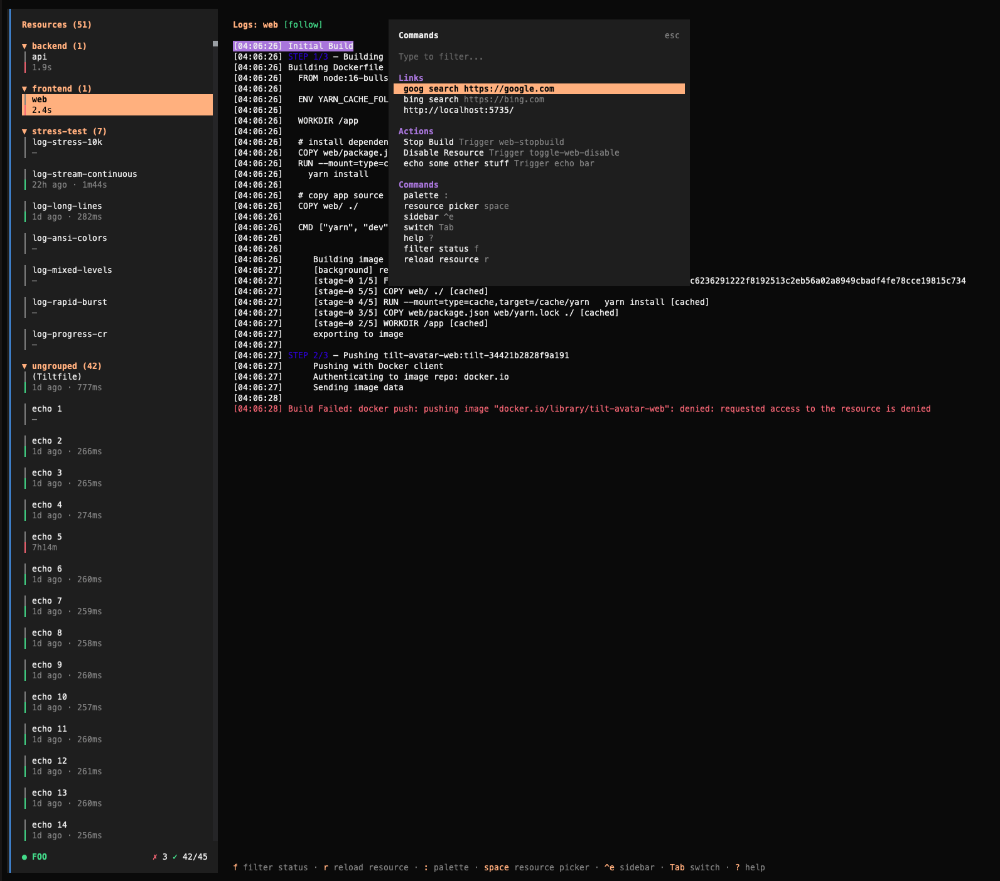

# Tilt Tui



## Requirements

- bun
- a running tilt process

## Running

### Dev Mode

```
bun install
bun dev
```

### Compile a Binary

compile a binary for the current platform

```
bun run build:binary:single
```

### Debugging

run debug command then click lick to open javascript debug console, or attach another debugger to port.

```
❯ bun run debug
$ SHOW_CONSOLE=true bun run --inspect-wait --conditions=browser --preload @opentui/solid/preload ./src/index.tsx
--------------------- Bun Inspector ---------------------
Listening:
  ws://localhost:6499/de2t02omqqh
Inspect in browser:
  https://debug.bun.sh/#localhost:6499/de2t02omqqh
--------------------- Bun Inspector ---------------------
```

## Using

`?` will show you list of context-aware keyboard shortcuts.
